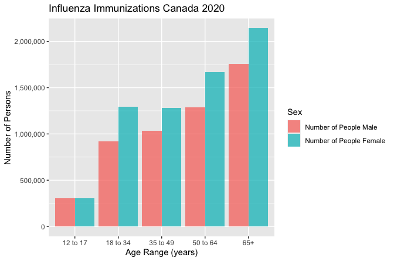
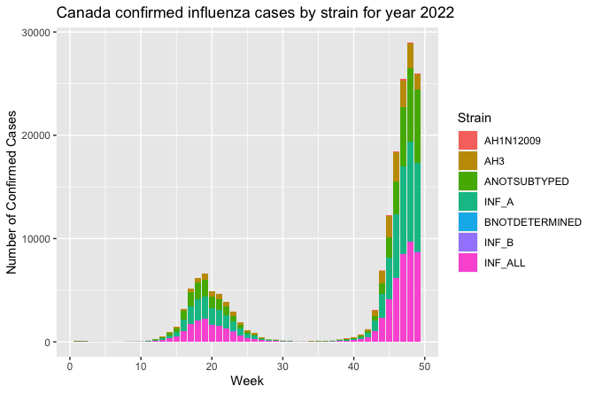
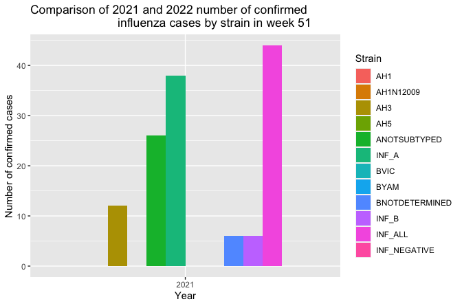
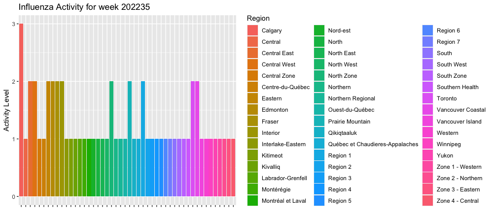
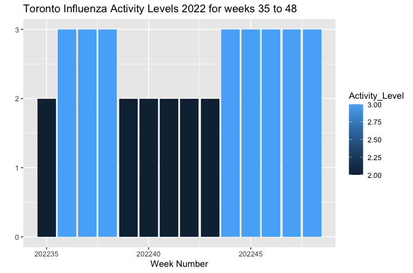

<!-- README.md is generated from README.Rmd. Please edit that file -->

```{r, include = FALSE}
knitr::opts_chunk$set(
  collapse = TRUE,
  comment = "#>",
  fig.path = "man/figures/README-",
  out.width = "100%"
)
```

# Flulytics
Load and visualize data of reported influenza cases, and influenza 
immunizations in Canada.

<!-- badges: start -->
<!-- https://www.codefactor.io/repository/github/shaunamia/flulytics/issues -->
[](https://www.codefactor.io/repository/github/shaunamia/flulytics) [](https://github.com/shaunamia/flulytics/issues)  [](./LICENSE)  
<!-- https://shields.io/category/license -->
<!-- badges: end -->

## Description
Flulytics is an R package that allows you to load and visualize data of reported 
influenza cases, and influenza immunizations in Canada. This package contains 
functions that allows you to view the raw data, generate customizable bar plots,
and search ncbi databases for the id's of records for each influenza strain in 
the data.

## Installation

To install the latest version of the package:

``` r
require("devtools")
install_github("shaunamia/flulytics", build_vignettes = TRUE)
library("Flulytics")
```


## Overview

`Flulytics` contains 4 functions.

For viewing the raw data provided in this package: __*view_data_table*__.

For carrying out a NCBI search for record id's based on user-set parameters: 
__*ncbi_search*__.

The shiny implementation of *ncbi_search*: __*runFlulytics*__.

For generating plots of provided data with user-set parameters: __*plot_data*__.

<div style="text-align:center">

Figure: Example output from __*plot_data*__, showing Immunization data for 
Canada in 2020.

<div style="text-align:center">

Figure: Example output from __*plot_data*__, showing confirmed influenza cases 
by strain in Canada 2022.

<div style="text-align:center">

Figure: Example output from __*plot_data*__, showing confirmed influenza cases 
by strain, and comparing the case counts for a given week in 2021 vs. 2022.

<div style="text-align:center">

Figure: Example output from __*plot_data*__, showing influenza activity by 
strain for a given week.

<div style="text-align:center">

Figure: Example output from __*plot_data*__, showing influenza activity by 
strain for a given region over all weeks.

<div style="text-align:left">
<div style="text-align:left">

To list all functions available in the package: 

``` r
ls("package:Flulytics")
```

To run the Shiny app:
``` r
Flulytics::runFlulytics()
```

<div style="text-align:center">
  
 Figure: Shiny app for Flulytics package allowing users to easily search NCBI databases for record ids for the strains in the data made available in this package and sample output in console.

<div style="text-align:left">
<div style="text-align:left">

## `Flulytics` Specifics

...


## Tutorials  
  
For tutorials, refer to the vignette:

``` r
browseVignettes("Flulytics")
```


## Citation for Package
``` r
citation("Flulytics")
```


## References for Package

*Public Health Agency of Canada. Influenza activity for Canada 2022
(https://ftp.maps.canada.ca/pub/phac_aspc/Influenza_Grippe/Influenza_Download_files/FGP_Influenza_activity_map.xlsx)

* FluNet. Influenza data for Canada 2021-2022. (https://www.who.int/tools/flunet)

* Statistics Canada. Table 13-10-0096-25 Influenza immunization in the past 12 months, by age group
DOI: https://doi.org/10.25318/1310009601-eng

* 


## Maintainer

* Shauna Vronces (shauna.vronces@mail.utoronto.ca). 


## Contributions

`Flulytics` welcomes issues, enhancement requests, and other contributions. To submit an issue, use the [GitHub issues](https://github.com/shaunamia/flulytics/issues).
